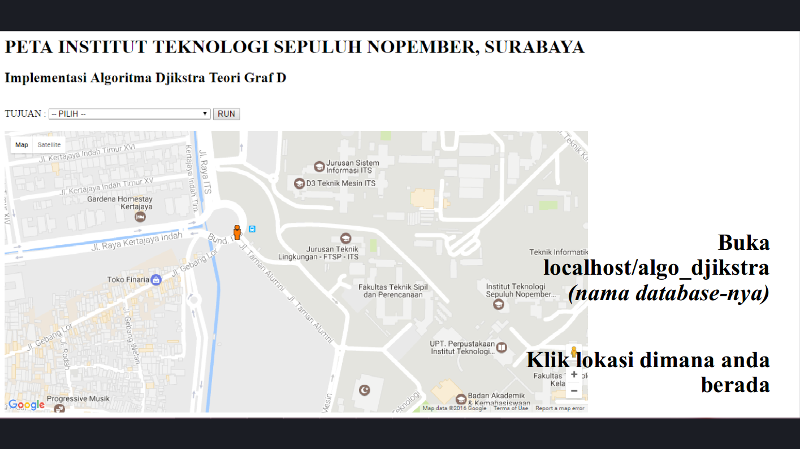
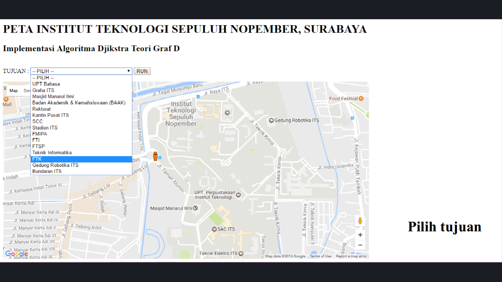
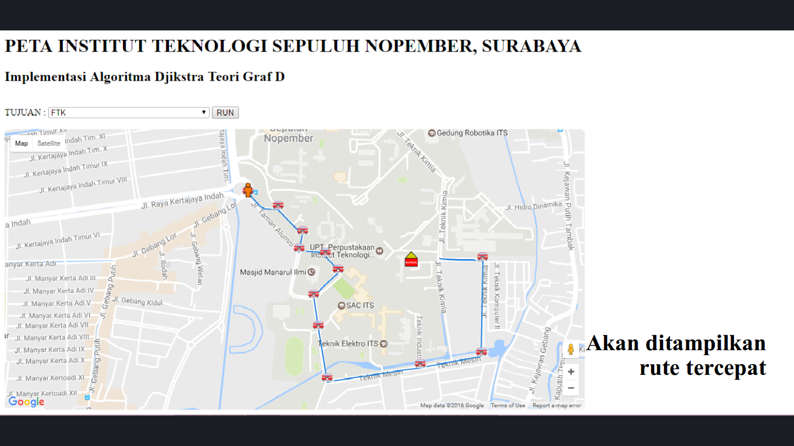

# Graph Theory

## Djikstra Algorithm Implementation to Determine the Shortest Path in ITS

By:
* Rahajeng Dwi P
* Hafara Firdausi
* Salma Nurkhafidoh
* Ana Alimatus Zaqiyah
  
### Tools
* **PHP** programming language for Web development
* **MySQL** as DBMS
* **graph.latcoding.com** dataset
* **XAMPP** as web server
* **phpMyAdmin** to handle the administration of MySQL over the Web
* **Windows** OS

### How to Use
1. Put this [**algo_djikstra**](algo-djikstra/) projects in the web server, e.g. XAMPP (for Windows OS) or another web server.
2. Create a database in MySQL and import this  [graph-latcodingcom-20122016_171407.sql](graph-latcodingcom-20122016_171407.sql) dataset.
3. Open your browser and access `localhost:8080/algo_djikstra`. Then, click where your location is.
   
    

4. Select the destination.
   
    

5. The web will display the shortest path to the destination.
   
    

